# TaskFlow

TaskFlow is an enterprise-grade task management platform built with ASP.NET Core and Clean Architecture. This repository is structured as a senior .NET portfolio project with production-oriented configuration, documentation, and test coverage.

## Documentation

| Resource | Description |
| -------- | ----------- |
| [Architecture](docs/architecture/Architecture.md) | Clean Architecture overview and diagrams |
| [Folder Structure](docs/architecture/FolderStructure.md) | Project layout and responsibilities |
| [Coding Standards](docs/architecture/CodingStandards.md) | Conventions and patterns |
| [Database](docs/architecture/Database.md) | Schema, migrations, and EF Core usage |
| [Authentication](docs/architecture/Authentication.md) | JWT, roles, and authorization model |
| [Deployment](docs/architecture/Deployment.md) | Docker, health probes, and production checklist |
| [ADRs](docs/adr/) | Architecture Decision Records |
| [Contributing](CONTRIBUTING.md) | Development workflow |
| [Security](SECURITY.md) | Vulnerability reporting and hardening |

## Technology Stack

- .NET 10 (SDK on build machine; targets latest LTS-aligned ASP.NET Core packages)
- ASP.NET Core Web API
- Entity Framework Core + SQL Server
- ASP.NET Core Identity
- JWT Bearer authentication
- FluentValidation
- Serilog
- Swagger / OpenAPI
- Docker + Docker Compose
- xUnit + Moq

## Solution Structure

```text
TaskFlow.slnx

src/
  TaskFlow.Api/                 # HTTP API, middleware, Swagger, health checks
  TaskFlow.Application/         # Use cases, interfaces, validators, configuration
  TaskFlow.Domain/              # Domain entities and rules (no dependencies)
  TaskFlow.Infrastructure/      # EF Core, Identity, JWT, external services
  TaskFlow.Contracts/           # API contracts for future endpoints
  TaskFlow.SharedKernel/        # Shared primitives (results, base types)

tests/
  TaskFlow.UnitTests/
  TaskFlow.IntegrationTests/
```

### Dependency Flow

```text
Domain -> (none)
SharedKernel -> (none)
Application -> Domain, SharedKernel
Infrastructure -> Application, Domain
Api -> Application, Infrastructure
```

## Prerequisites

- [.NET SDK 10](https://dotnet.microsoft.com/download)
- [Docker Desktop](https://www.docker.com/products/docker-desktop/) (optional, for containerized runs)
- SQL Server or Docker SQL Server container

## Run Locally

### 1. Restore and build

```bash
dotnet restore
dotnet build
```

### 2. Start SQL Server (Docker)

```bash
docker compose up -d sqlserver
```

### 3. Apply database migrations

```bash
dotnet ef database update --project src/TaskFlow.Infrastructure --startup-project src/TaskFlow.Api
```

### 4. Run the API

```bash
dotnet run --project src/TaskFlow.Api
```

Swagger UI (Development): `https://localhost:7xxx/swagger`  
Health endpoints:
- `/health` — all checks
- `/health/live` — liveness (process up)
- `/health/ready` — readiness (database connectivity)

## Docker Commands

Build and run API + SQL Server:

```bash
docker compose up --build
```

Run in detached mode:

```bash
docker compose up -d --build
```

Stop services:

```bash
docker compose down
```

Apply migrations against the Docker SQL Server:

```bash
dotnet ef database update --project src/TaskFlow.Infrastructure --startup-project src/TaskFlow.Api
```

## Database Migration Commands

Add a migration:

```bash
dotnet ef migrations add <MigrationName> --project src/TaskFlow.Infrastructure --startup-project src/TaskFlow.Api --output-dir Persistence/Migrations
```

Update database:

```bash
dotnet ef database update --project src/TaskFlow.Infrastructure --startup-project src/TaskFlow.Api
```

Remove last migration (if not applied):

```bash
dotnet ef migrations remove --project src/TaskFlow.Infrastructure --startup-project src/TaskFlow.Api
```

## Testing

```bash
dotnet test
```

## Authentication

TaskFlow uses **ASP.NET Core Identity** with **JWT access tokens** and **refresh tokens**.

### Endpoints

| Method | Path | Auth Required |
|--------|------|---------------|
| POST | `/api/auth/register` | No |
| POST | `/api/auth/login` | No |
| POST | `/api/auth/logout` | Yes |
| POST | `/api/auth/refresh-token` | No (refresh token in body) |
| POST | `/api/auth/change-password` | Yes |
| POST | `/api/auth/forgot-password` | No |
| POST | `/api/auth/reset-password` | No |
| POST | `/api/auth/verify-email` | No |
| POST | `/api/auth/resend-verification` | No |
| GET | `/api/auth/me` | Yes |

### JWT Usage

1. Register or login to receive an `accessToken` and `refreshToken` in the response body.
2. Send the access token on protected requests:

```http
Authorization: Bearer <access_token>
```

3. When the access token expires, call `POST /api/auth/refresh-token` with the refresh token in the JSON body (never in the URL).
4. Logout revokes the provided refresh token.

Access tokens include `userId`, `email`, and `roles` claims. Refresh tokens are stored as SHA-256 hashes in SQL Server and support rotation and revocation.

### Default Roles

Seeded at startup: `SuperAdmin`, `Admin`, `Manager`, `Member`.

New registrations are assigned the `Member` role. In Development, an optional SuperAdmin user is seeded when `Seed:SeedSuperAdmin` is `true`.

### Swagger Authentication

1. Run the API in Development and open `/swagger`.
2. Call `POST /api/auth/login` (or register) to obtain an access token.
3. Click **Authorize** in Swagger UI.
4. Enter: `Bearer <your_access_token>`
5. Execute secured endpoints such as `GET /api/auth/me`.

### Simulated Email Flows

Forgot password, email verification, and resend verification generate Identity tokens and log the event. No real emails are sent.

## Configuration

Strongly typed options are defined in `TaskFlow.Application`:

- `Database` – connection string and EF diagnostics
- `Jwt` – issuer, audience, secret, access/refresh token lifetimes
- `Seed` – optional SuperAdmin and sample organization seeding for development
- `FileStorage` – local profile image storage settings
- `LoggingOptions` – file path and request logging toggle

Configuration is bound using the ASP.NET Core Options pattern in extension methods.

## Organizations, Teams & User Management

TaskFlow supports **multi-organization** tenancy. Users can belong to multiple organizations, each with its own teams and members.

### Organization Role Hierarchy

| Role | Manage Organization | Manage Teams | Read Access |
|------|--------------------:|-------------:|:-----------:|
| Owner | Yes | Yes | Yes |
| Administrator | Yes | Yes | Yes |
| Manager | No | Yes | Yes |
| Member | No | No | Yes |

System **SuperAdmin** users bypass organization membership checks and can access all organizations.

### Entity Relationships

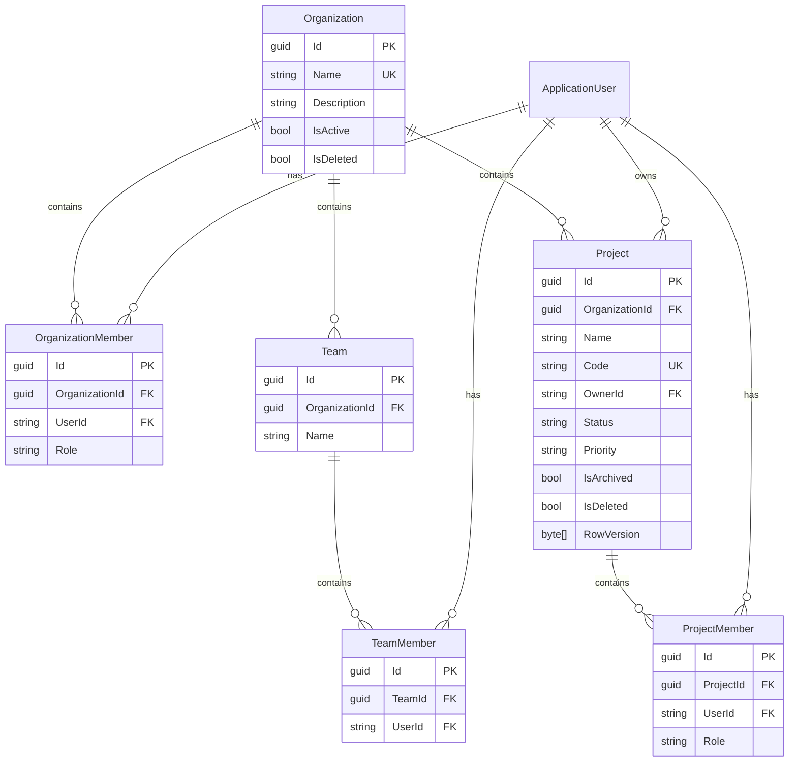

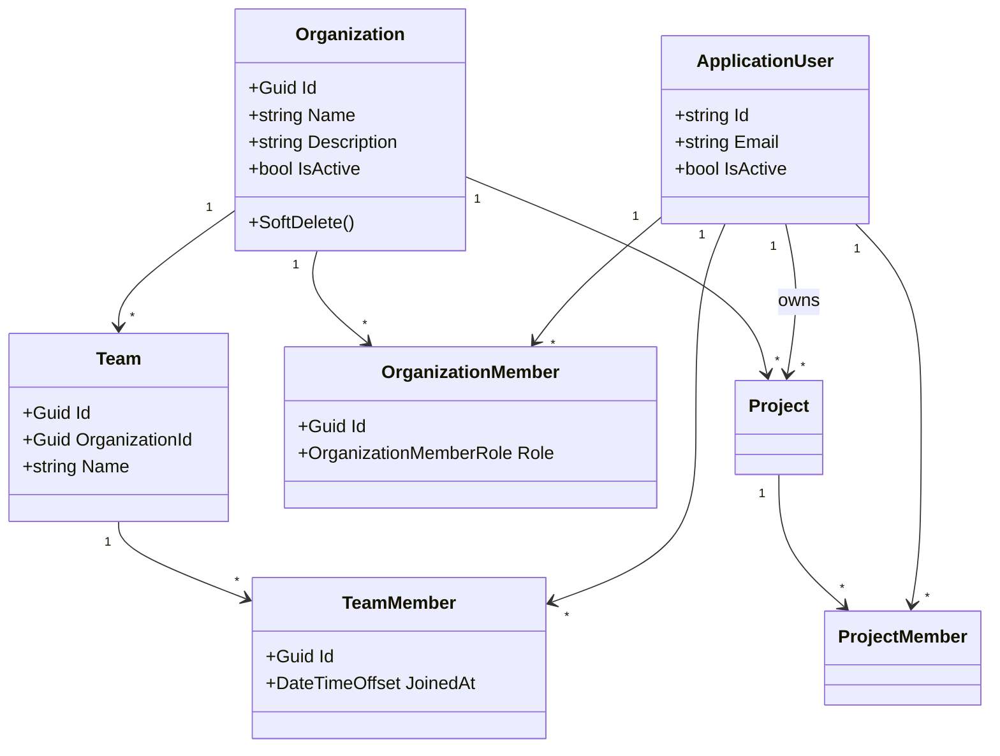

## Project Management

### Project Lifecycle

```text
Draft → Active → OnHold ↔ Active → Completed
                  ↓
              Cancelled
                  ↓
              Archived (immutable; use Restore to return to Draft)
```

- **Draft** – Initial state; editable.
- **Active** – Work in progress.
- **OnHold** – Paused; can return to Active.
- **Completed** / **Cancelled** – Terminal workflow states.
- **Archived** – Read-only; no modifications until restored.

Soft-deleted projects are hidden via a global query filter (`IsDeleted = true`).

### Project Role Hierarchy

| Role | Read | Manage Project | Manage Members | Delete / Archive | Transfer Ownership |
|------|:----:|:--------------:|:--------------:|:----------------:|:------------------:|
| Viewer | Yes | No | No | No | No |
| Contributor | Yes | No | No | No | No |
| Manager | Yes | Yes | Yes | No | No |
| Owner | Yes | Yes | Yes | Yes | Yes |

**Organization-level overrides:**

| Org Role | Create Projects | Full Project Access |
|----------|:---------------:|:-------------------:|
| Owner | Yes | Yes |
| Administrator | Yes | Yes |
| Manager | No | No (project membership required) |
| Member | No | No (project membership required) |

**SuperAdmin** bypasses all checks.

### Project Entity Relationships

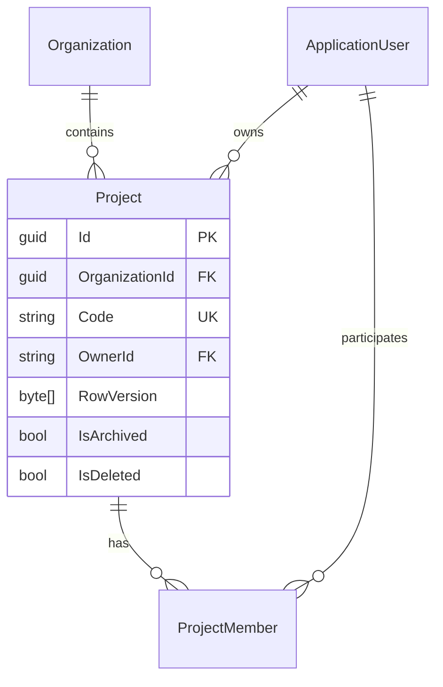

### Create Project Sequence

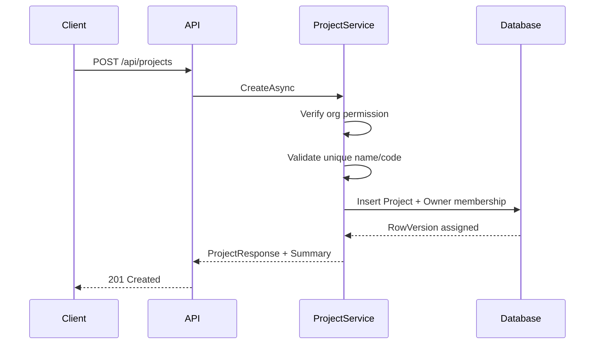

### Project API Examples

Create a project (creator becomes owner if `ownerId` is omitted):

```http
POST /api/projects
Authorization: Bearer <token>
Content-Type: application/json

{
  "organizationId": "<organization-id>",
  "name": "Customer Portal",
  "code": "CUST-PORTAL",
  "description": "Self-service portal",
  "status": "Draft",
  "priority": "High"
}
```

Update with optimistic concurrency (send `rowVersion` from the last GET response):

```http
PUT /api/projects/{projectId}
Authorization: Bearer <token>
Content-Type: application/json

{
  "name": "Customer Portal v2",
  "description": "Updated scope",
  "startDate": "2026-01-01",
  "endDate": null,
  "estimatedCompletionDate": "2026-12-31",
  "rowVersion": "<base64-row-version>"
}
```

Search projects with filters:

```http
GET /api/projects/search?name=portal&status=Active&organizationId=<id>&page=1&pageSize=20&sortBy=createdAt&sortDescending=true
Authorization: Bearer <token>
```

Transfer ownership:

```http
POST /api/projects/{projectId}/transfer-owner
Authorization: Bearer <token>
Content-Type: application/json

{
  "newOwnerId": "<user-id>"
}
```

Add a project member:

```http
POST /api/projects/{projectId}/members
Authorization: Bearer <token>
Content-Type: application/json

{
  "userId": "<user-id>",
  "role": "Contributor"
}
```

### Project Business Rules

- Project name is unique within an organization
- Project code is globally unique (stored uppercase)
- Every project has exactly one owner (`OwnerId` + `ProjectRole.Owner` membership)
- Owner cannot be removed without transferring ownership first
- Archived projects cannot be modified
- Deleted projects use soft delete (`IsDeleted` + global query filter)
- Updates use optimistic concurrency via `RowVersion` (returned as Base64 in API responses)
- Organization soft-delete is blocked when active (non-completed, non-cancelled, non-archived) projects exist

### Concurrency Handling

`Project.RowVersion` is configured as an EF Core row-version concurrency token. Clients must send the `rowVersion` value from their last read when calling `PUT /api/projects/{id}`. If another user modified the project first, the API returns `400 Bad Request` with a concurrency conflict message.

### Soft Delete

Projects set `IsDeleted = true` and `DeletedAt` on delete. A global EF query filter excludes deleted projects from all queries. Organization deletion checks for active projects before allowing soft delete.

### Project Endpoints

| Method | Endpoint | Description |
|--------|----------|-------------|
| POST | `/api/projects` | Create project |
| GET | `/api/projects` | List projects (pagination, filters) |
| GET | `/api/projects/search` | Advanced search |
| GET | `/api/projects/{id}` | Get project with summary |
| PUT | `/api/projects/{id}` | Update project |
| DELETE | `/api/projects/{id}` | Soft delete |
| POST | `/api/projects/{id}/archive` | Archive project |
| POST | `/api/projects/{id}/restore` | Restore archived project |
| POST | `/api/projects/{id}/transfer-owner` | Transfer ownership |
| PATCH | `/api/projects/{id}/status` | Change status |
| PATCH | `/api/projects/{id}/priority` | Change priority |
| GET | `/api/projects/{id}/members` | List members |
| POST | `/api/projects/{id}/members` | Add member |
| PUT | `/api/projects/{id}/members/{userId}` | Update member role |
| DELETE | `/api/projects/{id}/members/{userId}` | Remove member |

Create an organization (creator becomes Owner):

```http
POST /api/organizations
Authorization: Bearer <token>
Content-Type: application/json

{
  "name": "Acme Corp",
  "description": "Primary workspace",
  "logoUrl": null
}
```

List organizations with pagination and search:

```http
GET /api/organizations?page=1&pageSize=20&search=acme&sortBy=name
Authorization: Bearer <token>
```

Add a member to an organization:

```http
POST /api/organizations/{organizationId}/members
Authorization: Bearer <token>
Content-Type: application/json

{
  "userId": "<user-id>",
  "role": "Member"
}
```

Create a team:

```http
POST /api/teams
Authorization: Bearer <token>
Content-Type: application/json

{
  "organizationId": "<organization-id>",
  "name": "Engineering",
  "description": "Product engineering"
}
```

Upload a profile image:

```http
POST /api/users/{userId}/profile-image
Authorization: Bearer <token>
Content-Type: multipart/form-data

file: <image>
```

### Sample Seed Data

When `Seed:SeedSampleOrganization` is `true` (enabled in Development), the application seeds:

- Organization: **TaskFlow Demo Organization**
- Teams: **Engineering**, **Product**
- Users: `owner@taskflow.local`, `admin@taskflow.local`, `manager@taskflow.local`, `member1@taskflow.local`, `member2@taskflow.local` (password: `SampleUser123!`)
- Sample project: **Demo Project** (`DEMO-001`) with sample task **Set up development environment**

### Business Rules

- Organization names are globally unique
- Team names are unique within an organization
- Users must be organization members before joining a team
- Inactive users cannot be added to organizations or teams
- Duplicate memberships are prevented
- Organization soft-delete is blocked when active projects exist
- Users cannot elevate their own organization role

## Task Management

### Task Lifecycle

```text
Backlog → Todo → InProgress → InReview → Completed
              ↓         ↓
           Blocked    Cancelled (archived via archive endpoint)
```

- **Completed** automatically sets `CompletedAt`.
- **Archive** sets status to `Cancelled` (task-level archive without a separate flag).
- **Soft delete** hides tasks via `IsDeleted` global query filter; **restore** reverses soft delete.

### Task Hierarchy

```text
Project
 └── Task (Epic / Feature / Story / Bug / ...)
      ├── Subtasks (ParentTaskId → same ProjectId)
      ├── Assignments (multiple users)
      ├── Labels (many-to-many via TaskItemLabel)
      ├── Dependencies (TaskId → DependsOnTaskId)
      └── Checklists (ordered items)
```

### Task Authorization

| Role | Read | Create | Update All | Update Assigned | Manage Assignments / Labels / Dependencies |
|------|:----:|:------:|:----------:|:---------------:|:------------------------------------------:|
| Viewer | Yes | No | No | No | No |
| Contributor | Yes | Yes | No | Yes | No |
| Manager | Yes | Yes | Yes | Yes | Yes |
| Owner | Yes | Yes | Yes | Yes | Yes |

**SuperAdmin** and **Organization Owner/Administrator** have full access to all tasks in their scope.

### Entity Relationships

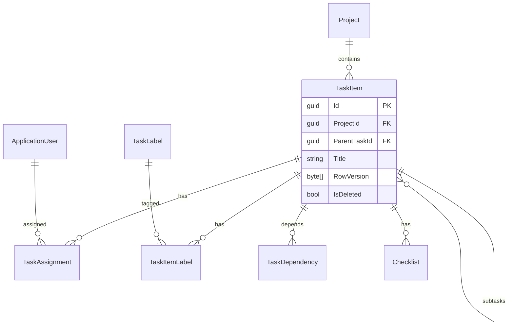

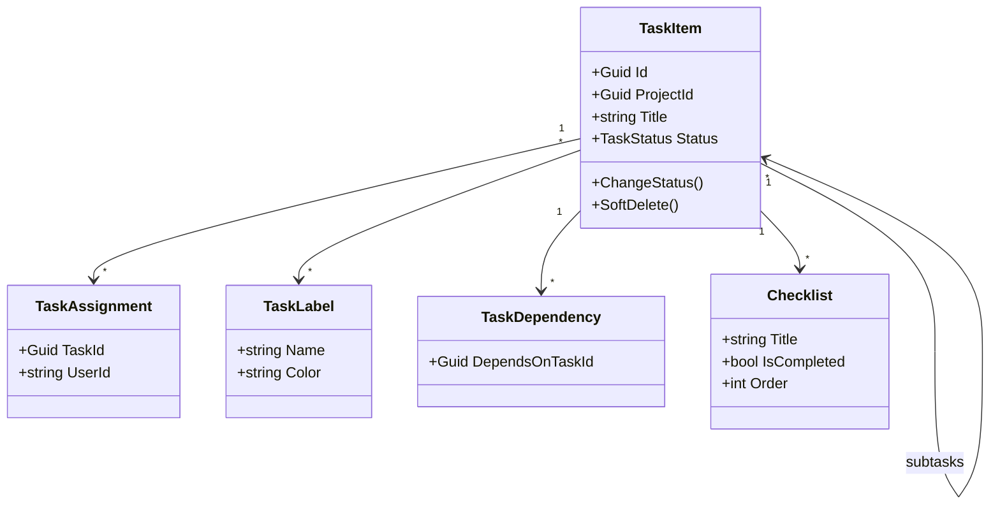

### Create Task Sequence

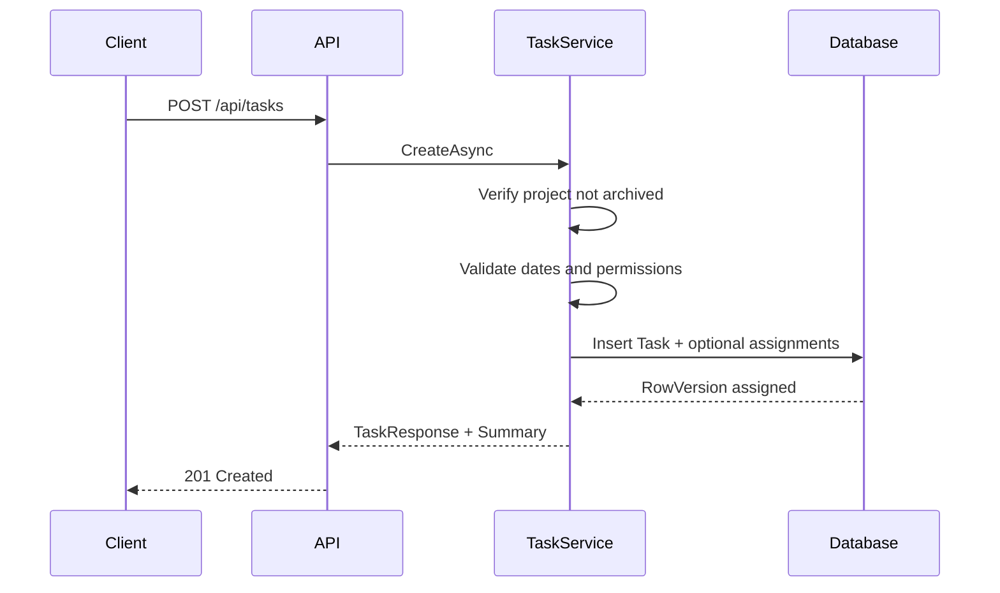

### Task API Examples

```http
POST /api/tasks
Authorization: Bearer <token>
Content-Type: application/json

{
  "projectId": "<project-id>",
  "title": "Implement login endpoint",
  "description": "JWT-based authentication",
  "status": "Todo",
  "priority": "High",
  "type": "Feature",
  "dueDate": "2026-12-31",
  "estimatedHours": 8
}
```

```http
PATCH /api/tasks/{taskId}/status
Authorization: Bearer <token>
Content-Type: application/json

{ "status": "Completed" }
```

```http
GET /api/tasks/search?projectId=<id>&assigneeId=<user-id>&status=InProgress&page=1&pageSize=20
Authorization: Bearer <token>
```

### Task Business Rules

- Task title is required; task belongs to exactly one project
- Due date cannot be earlier than start date
- Completed status automatically records `CompletedAt`
- Archived projects cannot receive new tasks
- Circular dependencies are prevented via graph traversal
- Subtasks must share the parent's project
- Soft delete with global query filter; restore uses `IgnoreQueryFilters`
- Optimistic concurrency via `RowVersion` (Base64 in API)

### Search Implementation

`GET /api/tasks` supports quick filters (project, search text, status, priority, type).  
`GET /api/tasks/search` adds advanced filters: title, description, assignee, label, and date ranges on start/due dates. Both endpoints paginate and sort (default: `createdAt` descending). Results are scoped to projects the caller can access (org admin or project member).

### Task Endpoints

| Method | Endpoint | Description |
|--------|----------|-------------|
| POST | `/api/tasks` | Create task |
| GET | `/api/tasks` | List tasks |
| GET | `/api/tasks/search` | Advanced search |
| GET | `/api/tasks/{id}` | Get task with summary |
| PUT | `/api/tasks/{id}` | Update task |
| DELETE | `/api/tasks/{id}` | Soft delete |
| POST | `/api/tasks/{id}/restore` | Restore deleted task |
| POST | `/api/tasks/{id}/archive` | Archive (Cancelled status) |
| POST | `/api/tasks/{id}/assign` | Assign users |
| DELETE | `/api/tasks/{id}/assign/{userId}` | Remove assignee |
| PATCH | `/api/tasks/{id}/status` | Change status |
| PATCH | `/api/tasks/{id}/priority` | Change priority |
| PATCH | `/api/tasks/{id}/hours` | Update estimated/actual hours |
| POST | `/api/tasks/{id}/move` | Move to another project |
| POST | `/api/tasks/{id}/clone` | Clone task |
| POST | `/api/tasks/{id}/duplicate` | Deep duplicate with subtasks |
| POST | `/api/tasks/{id}/subtasks` | Create subtask |
| DELETE | `/api/tasks/{id}/subtasks/{subTaskId}` | Delete subtask |
| POST | `/api/tasks/{id}/labels` | Add label |
| DELETE | `/api/tasks/{id}/labels/{labelId}` | Remove label |
| POST | `/api/tasks/{id}/dependencies` | Add dependency |
| DELETE | `/api/tasks/{id}/dependencies/{dependencyId}` | Remove dependency |
| POST | `/api/tasks/{id}/checklists` | Create checklist item |
| PUT | `/api/tasks/{id}/checklists/{checklistId}` | Update checklist item |
| DELETE | `/api/tasks/{id}/checklists/{checklistId}` | Delete checklist item |

## Comments & Attachments

### Comment Workflow

```text
Task
 └── Comment (top-level)
      ├── Reply (ParentCommentId)
      │    └── Nested replies
      └── Mentions (@user)
```

- Comments are soft-deleted; content becomes **"Comment deleted"** while replies remain visible.
- Edited comments set `IsEdited = true` and `EditedAt`.
- Mentions link to organization members only.

### Attachment Workflow

```text
Client → POST /api/tasks/{taskId}/attachments (multipart)
      → LocalFileStorageService validates and saves file
      → Metadata stored in SQL Server (Attachments table)
      → Download via GET /api/attachments/{id}/download (authorized)
```

### Local Storage Structure

```text
wwwroot/uploads/
  └── {year}/
       └── {month}/
            └── {taskId}/
                 └── {guid}.{ext}
```

Physical paths are never returned in API responses. Clients receive `/api/attachments/{id}/download` URLs only.

### Entity Relationships

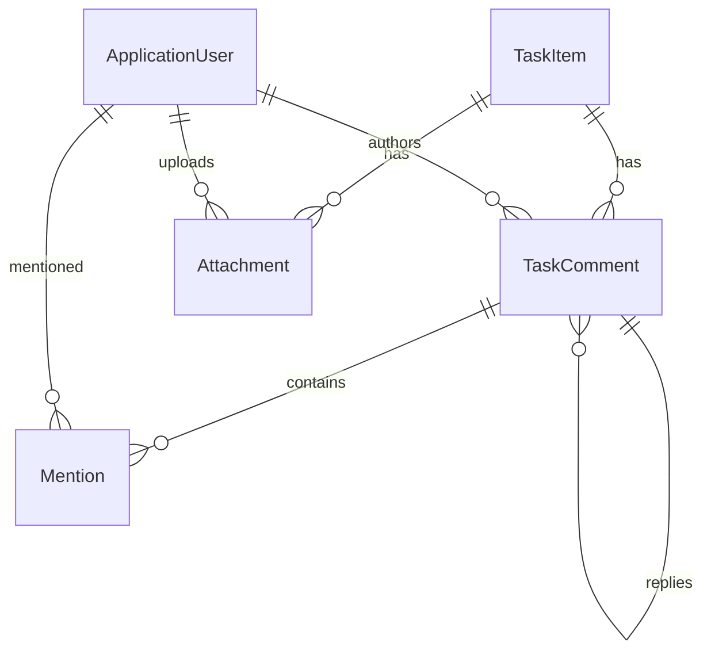

### Upload Sequence

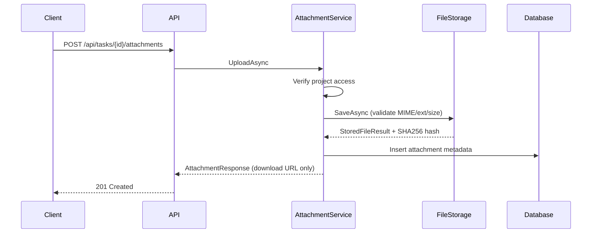

### API Examples

```http
POST /api/tasks/{taskId}/comments
Authorization: Bearer <token>
Content-Type: application/json

{
  "content": "Please review the API contract.",
  "mentionedUserIds": ["<user-id>"]
}
```

```http
POST /api/tasks/{taskId}/attachments
Authorization: Bearer <token>
Content-Type: multipart/form-data

file: <document.pdf>
```

### Security Considerations

- Extension, MIME type, and size validation on every upload
- Executable extensions (`.exe`, `.bat`, `.ps1`, etc.) are blocked
- Filenames sanitized; server generates unique stored names
- Path traversal prevented via rooted path resolution
- Downloads require authentication and project membership
- Duplicate file detection via SHA-256 hash per task (optional rejection)
- `IFileStorageService` abstraction allows swapping local storage for cloud later

### Collaboration Endpoints

| Method | Endpoint | Description |
|--------|----------|-------------|
| POST | `/api/tasks/{taskId}/comments` | Create comment |
| GET | `/api/tasks/{taskId}/comments` | List comments |
| GET | `/api/comments/search` | Search by task/user |
| GET | `/api/comments/{id}` | Get comment |
| GET | `/api/comments/{id}/thread` | Get comment thread |
| PUT | `/api/comments/{id}` | Edit comment |
| DELETE | `/api/comments/{id}` | Soft delete comment |
| POST | `/api/comments/{id}/reply` | Reply to comment |
| POST | `/api/comments/{id}/mentions` | Add mentions |
| POST | `/api/tasks/{taskId}/attachments` | Upload file |
| GET | `/api/tasks/{taskId}/attachments` | List attachments |
| GET | `/api/attachments/search` | Search by task/user |
| GET | `/api/attachments/{id}` | Get metadata |
| GET | `/api/attachments/{id}/download` | Download file |
| PUT | `/api/attachments/{id}` | Replace file |
| DELETE | `/api/attachments/{id}` | Delete file |

## Notifications

### Architecture

In-app notifications are persisted in SQL Server and exposed through REST APIs for frontend polling. The module follows Clean Architecture:

```text
Domain (Notification entity, NotificationType enum)
  ↓
Application (INotificationService, INotificationPublisher, DTOs, validators)
  ↓
Infrastructure (NotificationService, NotificationPublisher, NotificationTriggerService, EF mappings)
  ↓
Api (NotificationEndpoints)
```

Business services (tasks, projects, comments, organizations, teams) call `INotificationTriggerService` after successful domain operations. Triggers delegate to `INotificationPublisher`, which writes notification rows synchronously—no background jobs, queues, or SignalR.

### Notification Lifecycle

```text
1. Business event occurs (e.g. task assigned, comment added)
2. Service calls INotificationTriggerService
3. NotificationPublisher inserts Notification row (UserId, Type, Title, Message, ReferenceType, ReferenceId)
4. Client polls GET /api/notifications or GET /api/notifications/unread
5. User marks read (PATCH .../read) or deletes (DELETE .../{id})
6. Bulk operations: mark all read, delete all read notifications
```

Notifications are immutable after creation. Users can only access their own notifications (SuperAdmin may read any notification for troubleshooting).

### Entity Relationships

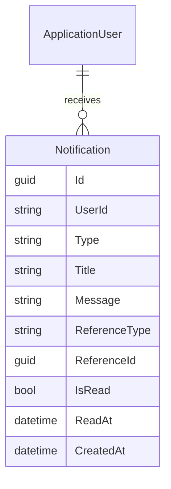

### Polling Sequence

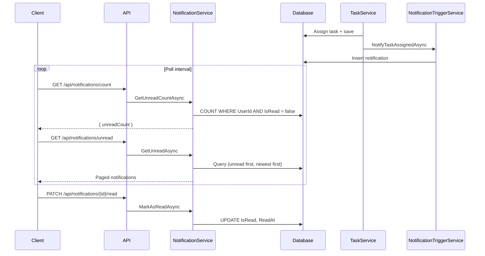

### Database Indexing

| Index | Purpose |
|-------|---------|
| `UserId` | Filter notifications per user (every query scopes by owner) |
| `IsRead` | Fast unread counts and unread-only lists |
| `CreatedAt` | Newest-first ordering and date-range filters |
| `(UserId, IsRead, CreatedAt)` | Composite covering the common poll pattern: user's unread/recent notifications |

### Notification Triggers

| Event | Notification Type |
|-------|-------------------|
| Task assigned | `TaskAssigned` |
| Task unassigned | `TaskUnassigned` |
| Task completed | `TaskCompleted` |
| Task reopened | `TaskReopened` |
| Task priority changed | `TaskPriorityChanged` |
| Task due date changed | `TaskDueDateChanged` |
| Task updated (general) | `TaskUpdated` |
| Comment added / reply | `TaskCommentAdded` |
| User mentioned | `MentionedInComment` |
| Project created | `ProjectCreated` |
| Project updated | `ProjectUpdated` |
| Project archived | `ProjectArchived` |
| Project ownership transferred | `ProjectOwnershipTransferred` |
| Organization member added | `OrganizationInvitation` |
| Organization role changed | `RoleChanged` |
| Team member added | `TeamMemberAdded` |

### Notification Endpoints

| Method | Endpoint | Description |
|--------|----------|-------------|
| GET | `/api/notifications` | List my notifications (pagination, filters) |
| GET | `/api/notifications/unread` | Unread notifications only |
| GET | `/api/notifications/count` | Unread count |
| GET | `/api/notifications/{id}` | Get single notification |
| PATCH | `/api/notifications/{id}/read` | Mark as read |
| PATCH | `/api/notifications/{id}/unread` | Mark as unread |
| PATCH | `/api/notifications/read-all` | Mark all as read |
| DELETE | `/api/notifications/{id}` | Delete notification |
| DELETE | `/api/notifications/read` | Delete all read notifications |

### API Examples

```http
GET /api/notifications?isRead=false&type=TaskAssigned&page=1&pageSize=20
Authorization: Bearer <token>
```

```http
PATCH /api/notifications/{id}/read
Authorization: Bearer <token>
```

```http
GET /api/notifications/count
Authorization: Bearer <token>

Response: { "unreadCount": 3 }
```

## Audit Logs & Activity History

### Architecture

```text
Domain (AuditLog, ActivityHistory)
  ↓
Application (IAuditLogPublisher, IActivityRecorder, IAuditTriggerService, DTOs, validators)
  ↓
Infrastructure (AuditLogPublisher, ActivityRecorder, AuditTriggerService, AuditLogService, ActivityHistoryService)
  ↓
Api (AuditEndpoints, AuditContextMiddleware)
```

Business services call `IAuditTriggerService` after successful operations. The trigger writes to both `AuditLogs` (security/business audit with JSON snapshots) and `ActivityHistory` (user-facing activity feed).

### Audit Strategy

| Concern | Approach |
|---------|----------|
| Immutability | Audit rows are append-only; no update or delete endpoints |
| Security audit | Login, logout, password change, authorization failures |
| Business audit | CRUD on orgs, projects, tasks, comments, attachments |
| Context capture | `AuditContextMiddleware` stores IP, UserAgent, CorrelationId (`TraceIdentifier`) per request |
| Change tracking | `OldValues` / `NewValues` JSON snapshots; insignificant fields filtered |

### Activity Lifecycle

```text
1. User performs action (e.g. creates task)
2. Service saves domain change
3. IAuditTriggerService records AuditLog + ActivityHistory
4. User polls GET /api/activity for personal feed
5. Admins/owners query GET /api/auditlogs for compliance review
```

### Entity Relationships

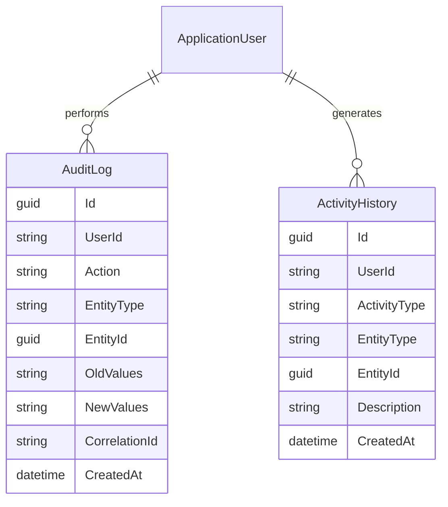

### Audit Sequence

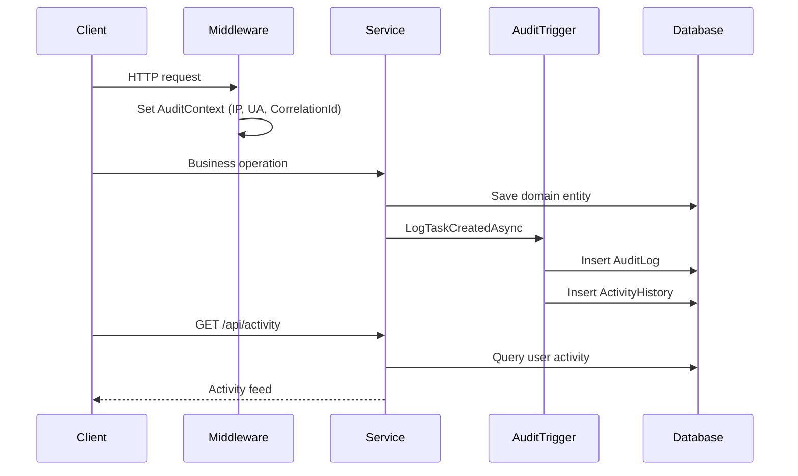

### Database Indexing

| Index | Purpose |
|-------|---------|
| `UserId` | Filter audit/activity by actor |
| `EntityType` + `EntityId` | Entity change history lookups |
| `Action` | Filter by operation type |
| `CreatedAt` | Date-range queries and sorting |
| Composite `(EntityType, EntityId, CreatedAt)` | Entity timeline queries |

### Authorization

| Endpoint | Access |
|----------|--------|
| `GET /api/auditlogs` | SuperAdmin, Admin, Organization Owner (org-scoped) |
| `GET /api/auditlogs/{id}` | Same as above |
| `GET /api/auditlogs/entity/{type}/{id}` | Same as above |
| `GET /api/auditlogs/user/{userId}` | Same as above |
| `GET /api/activity` | Authenticated user (own activity) |
| `GET /api/activity/user/{userId}` | Self, or admin/owner |
| `GET /api/activity/project/{projectId}` | Project members with read access |

### Audit Endpoints

| Method | Endpoint | Description |
|--------|----------|-------------|
| GET | `/api/auditlogs` | Search audit logs |
| GET | `/api/auditlogs/{id}` | Get audit log by ID |
| GET | `/api/auditlogs/entity/{entityType}/{entityId}` | Entity audit history |
| GET | `/api/auditlogs/user/{userId}` | User audit history |
| GET | `/api/activity` | My activity history |
| GET | `/api/activity/user/{userId}` | User activity history |
| GET | `/api/activity/project/{projectId}` | Project activity history |

## Dashboard, Analytics & Reporting

### Architecture

```text
Application (IDashboardService, IReportService, IReportingAccessService, DTOs)
  ↓
Infrastructure (DashboardService, ReportService, ReportingQueryScope)
  ↓
Api (DashboardEndpoints → /api/dashboard/* and /api/reports/*)
```

All analytics are computed on-demand from existing SQL Server tables via EF Core. No caching, background jobs, or external reporting tools.

### Reporting Strategy

| Layer | Responsibility |
|-------|----------------|
| `ReportingQueryScope` | Builds accessible task/project/org queries scoped to user membership |
| `DashboardService` | Aggregates KPIs for personal, project, and organization views |
| `ReportService` | Generates paginated reports with chart-ready JSON (`DistributionChart`, `TrendChart`) |
| `ReportingAccessService` | Enforces role-based access before any query executes |

### Analytics Sequence

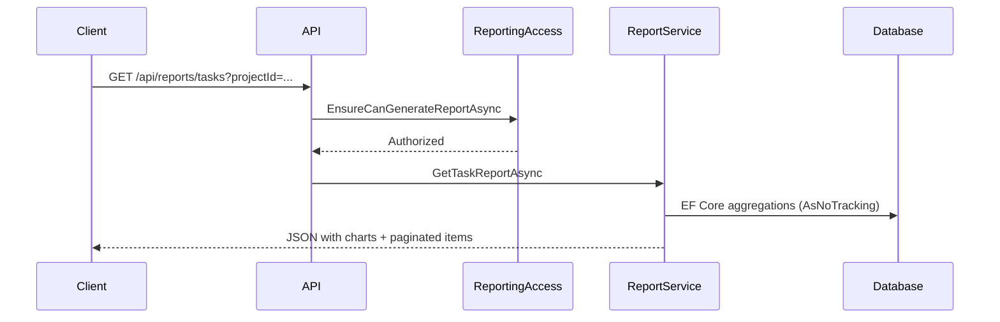

### Dashboard Endpoints

| Method | Endpoint | Access |
|--------|----------|--------|
| GET | `/api/dashboard/me` | Authenticated user (own data) |
| GET | `/api/dashboard/project/{projectId}` | Project read access |
| GET | `/api/dashboard/organization/{organizationId}` | Manager, Administrator, Owner |

### Report Endpoints

| Method | Endpoint | Description |
|--------|----------|-------------|
| GET | `/api/reports/tasks` | Task report with status/priority/type charts |
| GET | `/api/reports/projects` | Project report |
| GET | `/api/reports/organizations` | Organization report |
| GET | `/api/reports/users` | User activity report |
| GET | `/api/reports/workload` | Workload distribution |
| GET | `/api/reports/productivity` | Productivity trend (area chart) |
| GET | `/api/reports/overdue` | Overdue tasks |
| GET | `/api/reports/completion` | Task completion trend (line chart) |
| GET | `/api/reports/priority` | Priority distribution (pie chart) |
| GET | `/api/reports/status` | Status distribution (bar chart) |
| GET | `/api/reports/statistics` | Aggregate counts |
| GET | `/api/reports/activity` | Activity history report |
| GET | `/api/reports/audit` | Audit log report |

All report endpoints accept `ReportFilterQuery` parameters: `dateFrom`, `dateTo`, `organizationId`, `projectId`, `userId`, `status`, `priority`, `taskType`, `page`, `pageSize`, `sortBy`, `sortDescending`.

### Example Response (Personal Dashboard)

```json
{
  "assignedTasks": 12,
  "overdueTasks": 2,
  "completedTasks": 45,
  "tasksDueToday": 3,
  "tasksDueThisWeek": 8,
  "productivity": {
    "completedThisWeek": 5,
    "completedThisMonth": 18,
    "completedTotal": 45
  }
}
```

## Current Scope

This release includes:

- Clean Architecture project layout
- Full authentication and authorization module
- Multi-organization, team, and user management
- Project management with membership, lifecycle, and search
- Task management with assignments, subtasks, labels, dependencies, checklists, and search
- Comments and attachments with threaded replies, mentions, and local file storage
- In-app notifications with REST polling, triggers on business events, and unread management
- Audit logs and activity history with immutable records, JSON snapshots, and role-based access
- Dashboard, analytics, and reporting with on-demand EF Core aggregations and chart-ready JSON
- Organization-scoped and project-scoped role-based access control
- ASP.NET Core Identity with extended `ApplicationUser`
- JWT + refresh token rotation
- Global exception handling with ProblemDetails
- Structured Serilog logging (console + file)
- Swagger with JWT authorization support
- `/health` endpoint with SQL Server check
- `/health/live` and `/health/ready` probe endpoints
- Docker Compose orchestration with upload and log volumes
- Production configuration profile and CI workflow
- Architecture documentation and ADRs under `docs/`

## Screenshots

<!-- Add screenshots of Swagger UI, dashboard responses, or Docker Compose startup when available -->

| Screenshot | Description |
| ---------- | ----------- |
| `docs/images/swagger.png` | Swagger UI with JWT authorization |
| `docs/images/dashboard.png` | Personal dashboard JSON response |
| `docs/images/docker.png` | Docker Compose services running |

## Future Enhancements

- Azure Blob Storage for attachments (see [ADR-006](docs/adr/ADR-006-FileStorage.md))
- Real-time notifications via SignalR (currently REST polling)
- Rate limiting and API versioning middleware
- Expanded integration test coverage for report and user endpoints
- Frontend SPA consuming the REST API
- Notification and audit retention policies
- OpenTelemetry distributed tracing export
