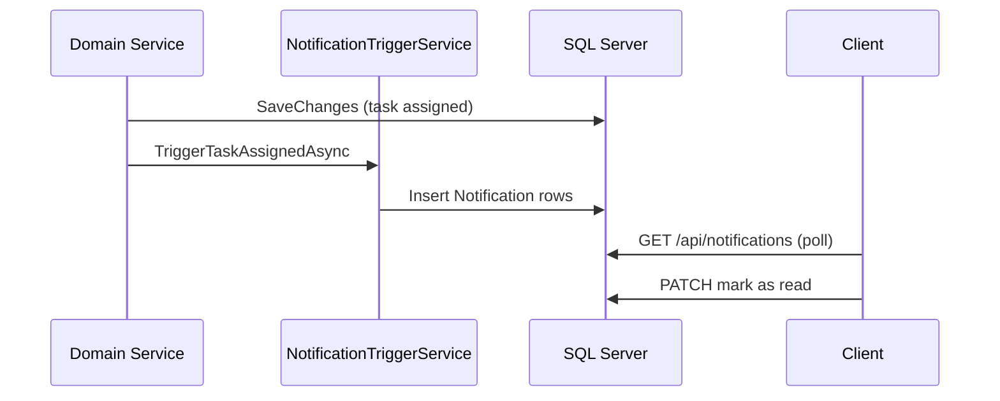

# ADR-007: Notification Design

## Status

Accepted

## Context

Users need awareness of task assignments, mentions, status changes, and project updates. Real-time push (SignalR) is explicitly out of scope.

## Decision

Implement **in-app notifications** persisted in SQL Server with **REST polling** APIs:

- `Notification` entity linked to user
- `NotificationTriggerService` creates notifications after domain mutations
- `NotificationService` provides paginated read, mark-read, and unread count endpoints

## Notification Flow

## Alternatives Considered

| Alternative | Why Not Chosen |
| ----------- | -------------- |
| SignalR real-time push | Explicitly excluded from scope |
| Email/SMS notifications | Requires external providers and templates |
| Message queue (Service Bus) | Operational complexity for current scale |

## Consequences

**Positive**

- Simple, testable, no additional infrastructure.
- Notification history available for audit and UX.

**Negative**

- Polling latency vs push notifications.
- Database growth; retention policy may be needed later.

## References

- [Architecture.md](../architecture/Architecture.md)
