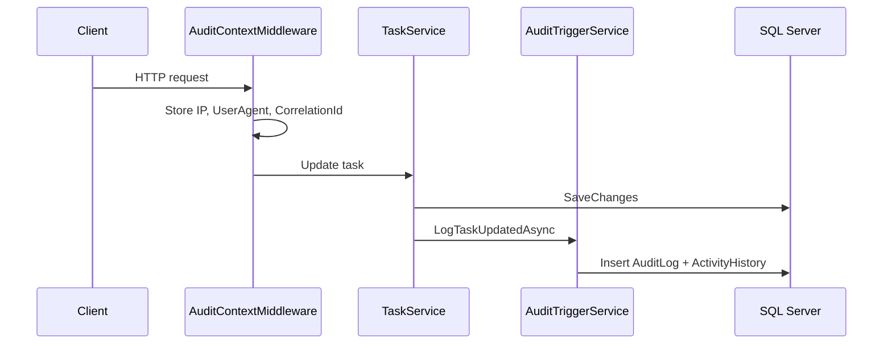

# ADR-008: Audit Logging

## Status

Accepted

## Context

Enterprise task platforms require immutable activity records for compliance, troubleshooting, and user-facing activity feeds.

## Decision

Implement dual persistence:

1. **`AuditLog`** — immutable security/compliance log (who, what, when, IP, user agent, correlation ID)
2. **`ActivityHistory`** — user-facing activity feed with human-readable summaries

`AuditTriggerService` is invoked from feature services after successful mutations. `AuditContextMiddleware` captures HTTP context per request.

## Audit Flow

## Alternatives Considered

| Alternative | Why Not Chosen |
| ----------- | -------------- |
| EF Core change tracking interceptor only | Insufficient context (IP, business event type) |
| External audit SaaS | Cost and complexity for portfolio project |
| Event sourcing | Full event store out of scope |

## Consequences

**Positive**

- Rich context for security investigations.
- Activity feed decoupled from low-level audit detail.
- Correlation ID links logs to Problem Details responses.

**Negative**

- Additional writes on every mutation (performance overhead).
- `AuditTriggerService` grows with feature surface area.
- Audit logs are append-only — no update/delete endpoints by design.

## References

- [Architecture.md](../architecture/Architecture.md)
