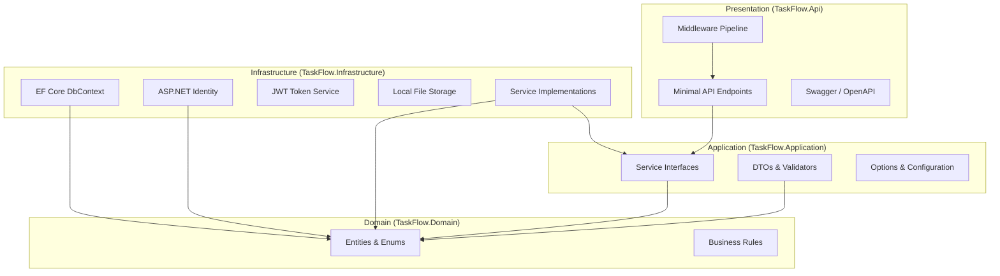
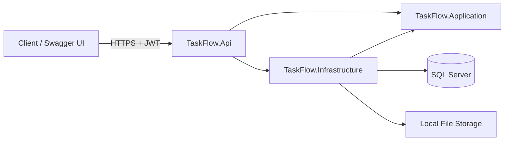
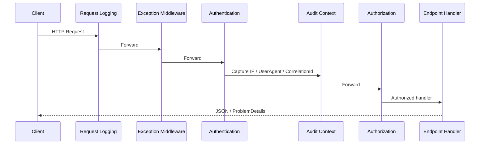
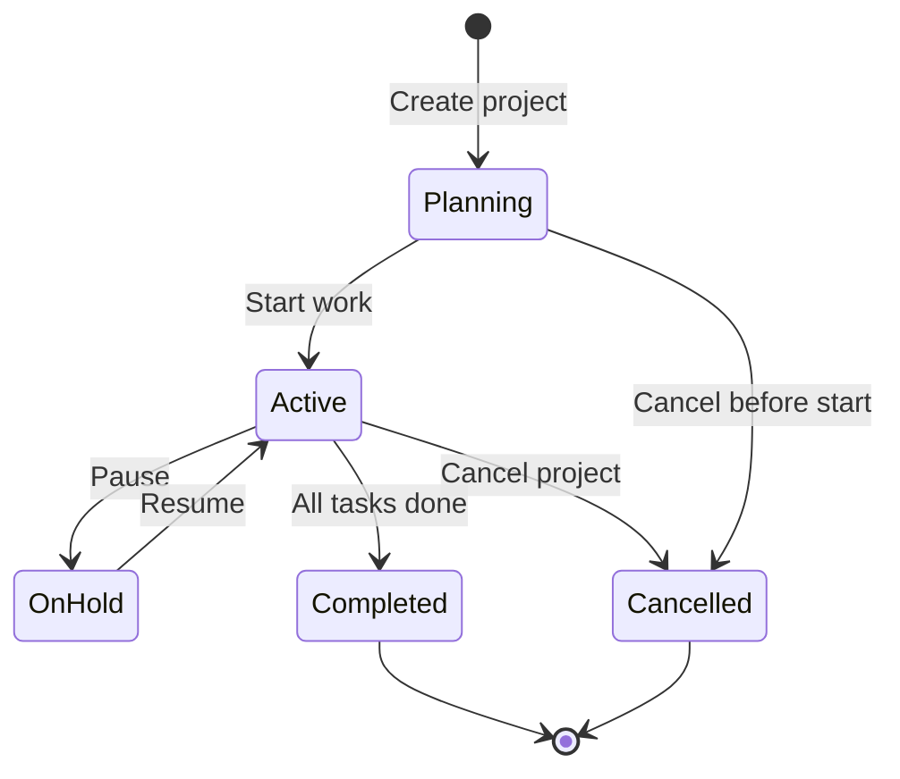
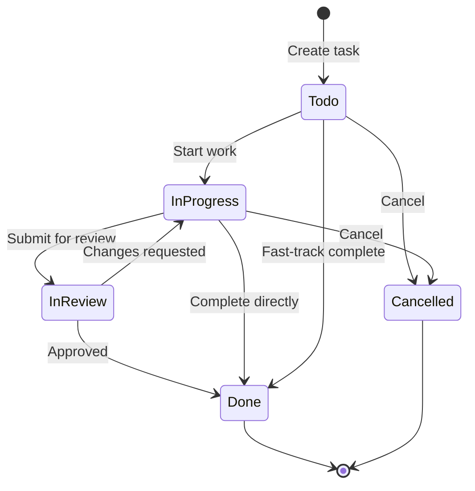

# Architecture

TaskFlow follows **Clean Architecture** (Onion Architecture) with explicit dependency direction: inner layers never depend on outer layers.

## Layer Responsibilities

| Layer | Project | Responsibility |
| ----- | ------- | -------------- |
| Domain | `TaskFlow.Domain` | Entities, enums, domain constants, invariants |
| Application | `TaskFlow.Application` | DTOs, interfaces, validators, options, use-case contracts |
| Infrastructure | `TaskFlow.Infrastructure` | EF Core, Identity, JWT, file storage, service implementations |
| API | `TaskFlow.Api` | HTTP endpoints, middleware, Swagger, health checks |
| Shared Kernel | `TaskFlow.SharedKernel` | Cross-cutting primitives (`Result<T>`, `DomainException`) |

## Clean Architecture Diagram

## Overall Solution Architecture

## Cross-Cutting Concerns

- **Validation:** FluentValidation in Application; auto-validation + endpoint filters in API.
- **Errors:** Global exception middleware returns RFC 7807 Problem Details with `correlationId`.
- **Logging:** Serilog with structured properties, request logging, and correlation ID enrichment.
- **Audit:** `IAuditTriggerService` records immutable audit entries after successful mutations.
- **Notifications:** `INotificationTriggerService` creates in-app notifications after domain events.
- **Access control:** Dedicated `*AccessService` classes enforce organization/project/task/report scope.

## Design Principles

1. **No generic repository** — EF Core `DbContext` is used directly in services (see ADR-002).
2. **Result pattern** — Expected failures return `Result`/`Result<T>` instead of throwing.
3. **Soft delete** — Entities implement soft delete with global query filters (see ADR-004).
4. **Optimistic concurrency** — Row version tokens on aggregate roots (see ADR-005).
5. **Trigger services** — Side effects (audit, notifications) are invoked after `SaveChangesAsync`.

## Request Pipeline

## Module Map

| Module | Primary Services | API Prefix |
| ------ | ---------------- | ---------- |
| Auth | `AuthService`, `JwtTokenService` | `/api/auth` |
| Organizations | `OrganizationService` | `/api/organizations` |
| Teams | `TeamService` | `/api/teams` |
| Users | `UserManagementService` | `/api/users` |
| Projects | `ProjectService` | `/api/projects` |
| Tasks | `TaskService` | `/api/tasks` |
| Comments | `CommentService` | `/api/comments` |
| Attachments | `AttachmentService` | `/api/attachments` |
| Notifications | `NotificationService` | `/api/notifications` |
| Audit | `AuditLogService`, `ActivityHistoryService` | `/api/auditlogs`, `/api/activity` |
| Dashboard | `DashboardService` | `/api/dashboard` |
| Reports | `ReportService` | `/api/reports` |

## Lifecycle Diagrams

### Project Lifecycle

### Task Lifecycle

## Related Documents

- [FolderStructure.md](FolderStructure.md)
- [CodingStandards.md](CodingStandards.md)
- [Authentication.md](Authentication.md)
- [Database.md](Database.md)
- [Deployment.md](Deployment.md)
