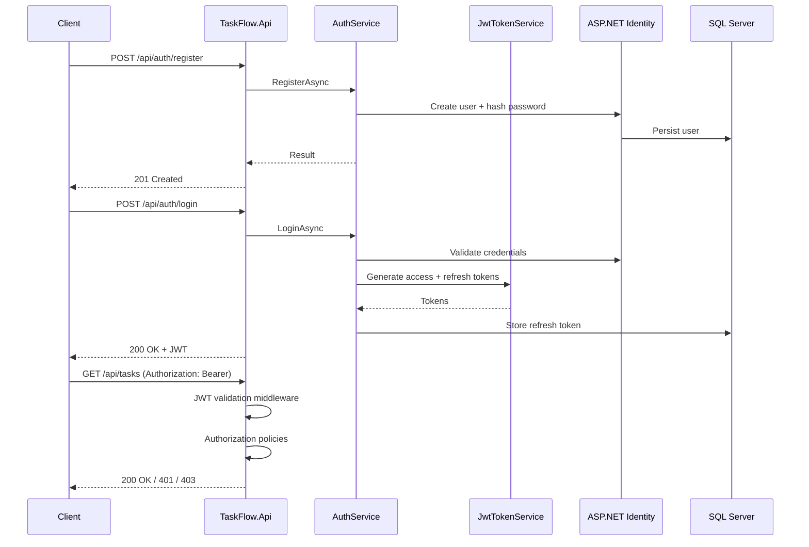
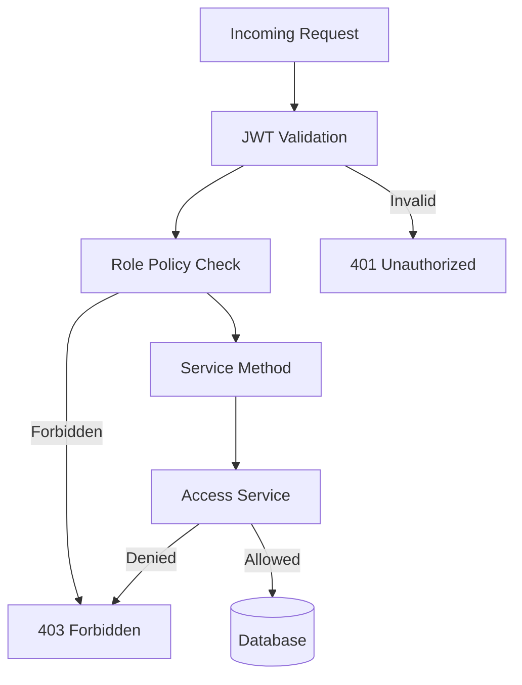

# Authentication & Authorization

## Authentication Flow

## JWT Configuration

Bound from `Jwt` section (`JwtOptions`):

| Setting | Description |
| ------- | ----------- |
| `Issuer` | Token issuer claim |
| `Audience` | Valid audience |
| `SecretKey` | Symmetric signing key (**must be secret in production**) |
| `AccessTokenExpirationMinutes` | Access token lifetime |
| `RefreshTokenExpirationDays` | Refresh token lifetime |

Environment overrides: `Jwt__SecretKey`, `Jwt__Issuer`, etc.

## Token Refresh

1. Client sends refresh token to `POST /api/auth/refresh`.
2. Server validates stored refresh token (not revoked, not expired).
3. New access token issued; refresh token may be rotated.

## Roles

Defined in `TaskFlow.Domain.Constants.Roles`:

| Role | Scope |
| ---- | ----- |
| SuperAdmin | Platform-wide administration |
| OrganizationAdmin | Organization management |
| ProjectManager | Project-level management |
| TeamLead | Team coordination |
| Member | Standard user |
| Viewer | Read-only access |

Roles are ASP.NET Core Identity roles assigned via user management endpoints.

## Authorization Model

Authorization is enforced at two levels:

1. **Endpoint level** — `[RequireAuthorization]` and role policies on route groups.
2. **Service level** — `*AccessService` classes verify organization/project/task membership before mutations and sensitive reads.

## Password Handling

- Passwords hashed by ASP.NET Core Identity (`PasswordHasher`).
- Password requirements configured in Infrastructure DI.
- Passwords never logged or returned in API responses.

## Security Recommendations

- Use HTTPS everywhere; enable HSTS in production.
- Store `Jwt:SecretKey` in a secret manager (Azure Key Vault, etc.).
- Rotate refresh tokens on use.
- Set short access token lifetime (15–60 minutes) for production.
- Disable detailed EF errors and sensitive logging in production.

See [SECURITY.md](../../SECURITY.md) for vulnerability reporting.
