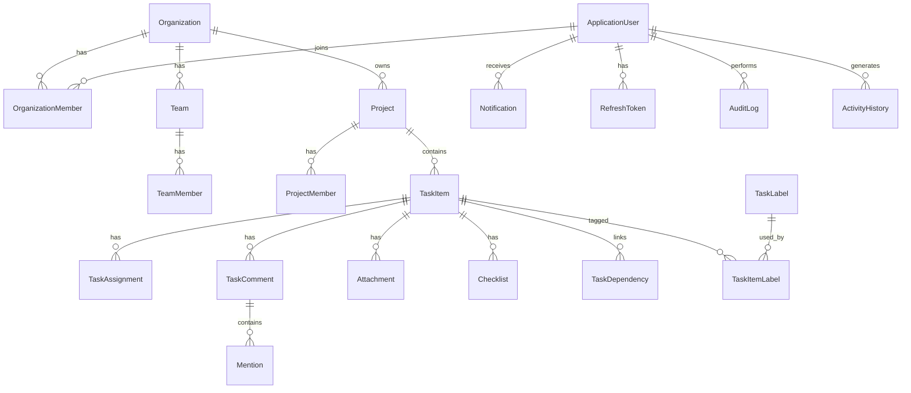

# Database

TaskFlow uses **Entity Framework Core** with **SQL Server** as the primary store. Integration tests use an in-memory EF provider.

## Entity Relationship Diagram



## Key Schema Features

| Feature | Implementation |
| ------- | -------------- |
| Soft delete | `ISoftDeletable` + global query filter |
| Optimistic concurrency | `RowVersion` byte array on aggregates |
| Auditing | `CreatedAt`, `UpdatedAt`, `CreatedBy`, `UpdatedBy` on base entities |
| Identity | ASP.NET Core Identity tables via `ApplicationUser` |

## Migrations

Create a migration after entity or configuration changes:

```bash
dotnet ef migrations add <MigrationName> \
  --project src/TaskFlow.Infrastructure \
  --startup-project src/TaskFlow.Api
```

Apply migrations:

```bash
dotnet ef database update \
  --project src/TaskFlow.Infrastructure \
  --startup-project src/TaskFlow.Api
```

### Startup Migration Behavior

`Database:ApplyMigrationsOnStartup` controls whether migrations run when the API starts:

| Environment | Default | Recommendation |
| ----------- | ------- | -------------- |
| Development | `true` | Convenient local setup |
| Docker Compose | `true` | Demo / local containers |
| Production | `false` | Run from CI/CD or init job |

## Configuration

```json
{
  "Database": {
    "ConnectionString": "Server=...;Database=TaskFlowDb;...",
    "ApplyMigrationsOnStartup": true,
    "EnableSensitiveDataLogging": false,
    "EnableDetailedErrors": false,
    "UseInMemory": false
  }
}
```

Environment variable: `Database__ConnectionString`.

## Seeding

`DataSeeder` runs after migrations:

- Always seeds **Identity roles**.
- Optionally seeds SuperAdmin and sample organization when `Seed:SeedSuperAdmin` / `Seed:SeedSampleOrganization` are `true` (Development only).

## Query Performance Guidelines

- List endpoints use server-side pagination (`Skip`/`Take`).
- Read queries use `AsNoTracking()`.
- Dashboard and report queries project aggregates in SQL.
- Avoid N+1: batch load related data or use explicit includes.

## Health Check

SQL connectivity is verified by the `sqlserver` health check tagged `ready`, exposed at `/health/ready`.
